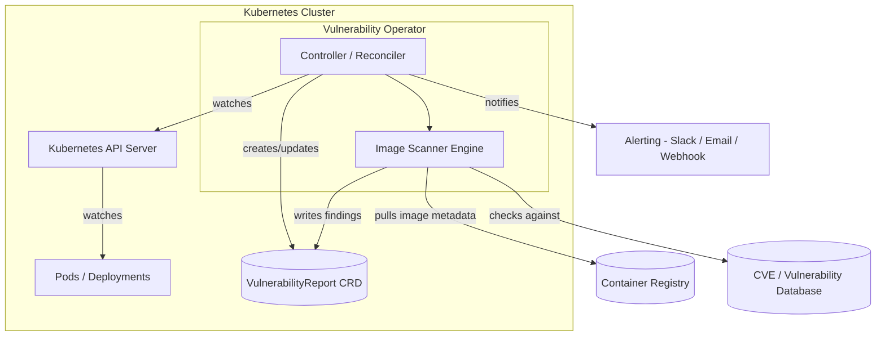

# vulnerable-demo

## Architecture

The operator watches Pods/Deployments via the Kubernetes API, scans their container images against a CVE database, writes results to a `VulnerabilityReport` custom resource, and sends alerts for critical findings.

## Demo

[Vulnerablity-operator-demo.mp4](./Vulnerablity-operator-demo.mp4)